# YT Jam — System Design

## 1. High-level architecture

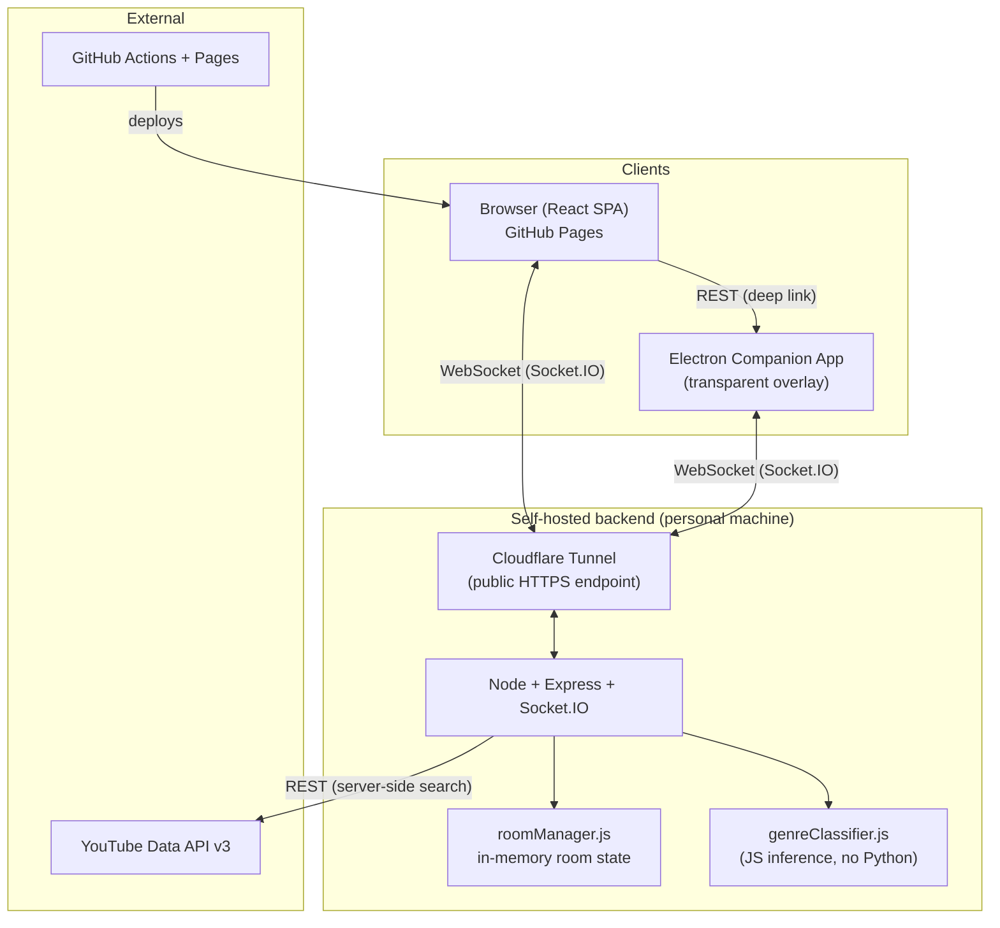

**Why this shape:** Socket.IO needs a long-lived, stateful connection, which rules out serverless/Lambda. Every free host with persistent WebSocket support now wants a card on file (or has shut down, in Glitch's case) — so the backend runs on a personal machine and is exposed publicly through a Cloudflare Tunnel, with automation to survive the resulting URL instability (see §6).

---

## 2. Component breakdown

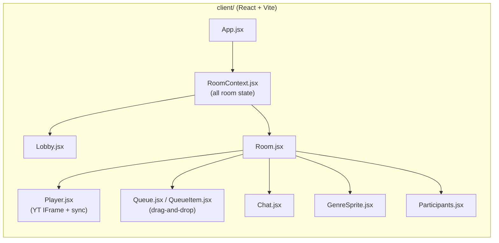

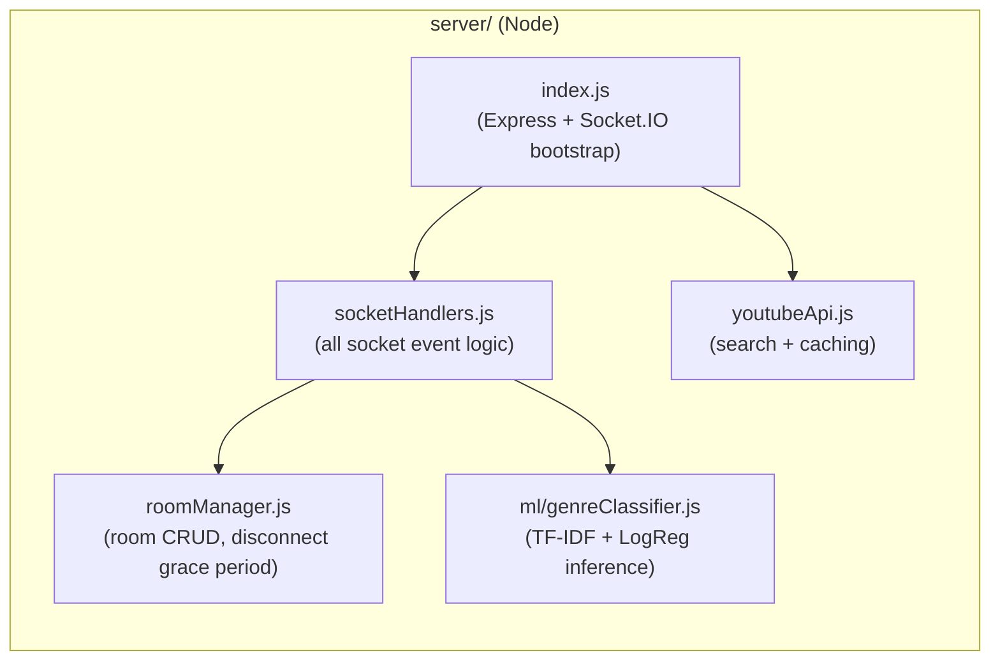

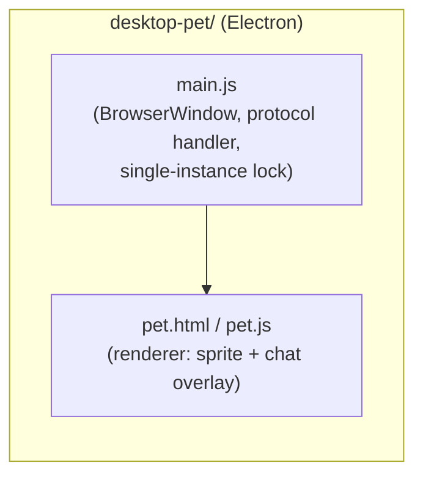

---

## 3. Data model — room state (in-memory, keyed by 6-char room code)

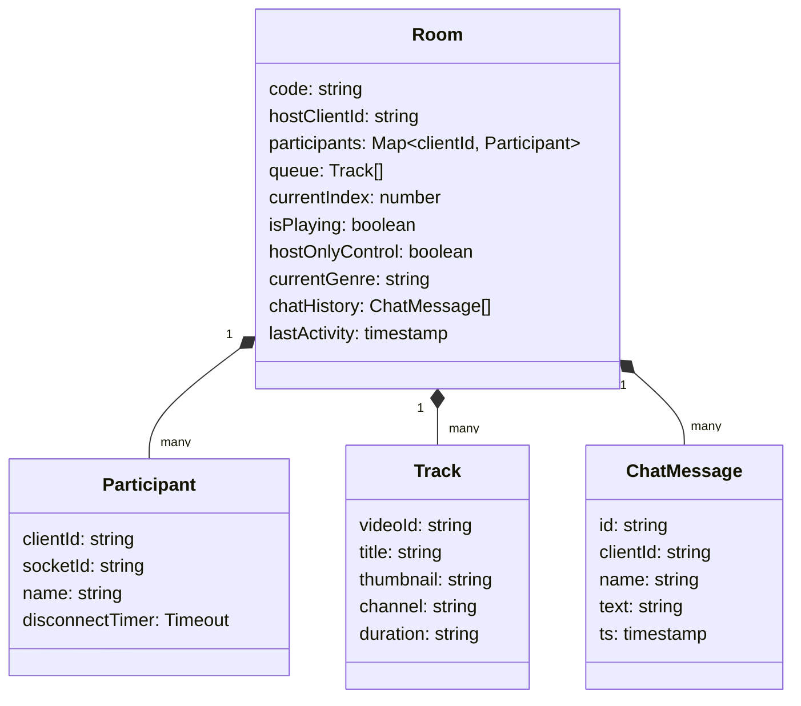

**Key design choice:** `participants` is keyed by `clientId` (a UUID persisted in the browser's `localStorage`), not `socket.id`. `socket.id` changes on every reconnect (page reload, network blip, sleep/wake) — keying by it caused participants to silently vanish and lose playback control on reconnect. `clientId` is stable across the whole browser session regardless of how many times the underlying socket connection drops and re-establishes.

---

## 4. Sequence: room creation, join, and reconnection

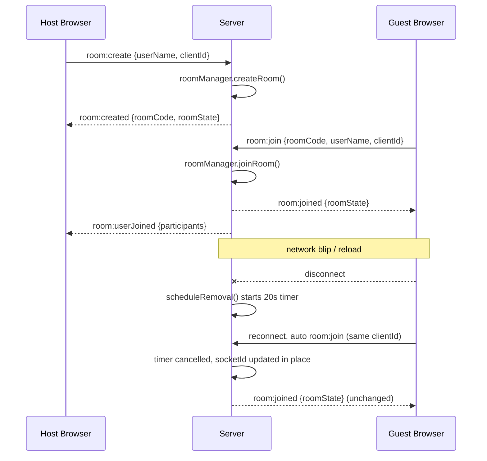

---

## 5. Sequence: playback sync

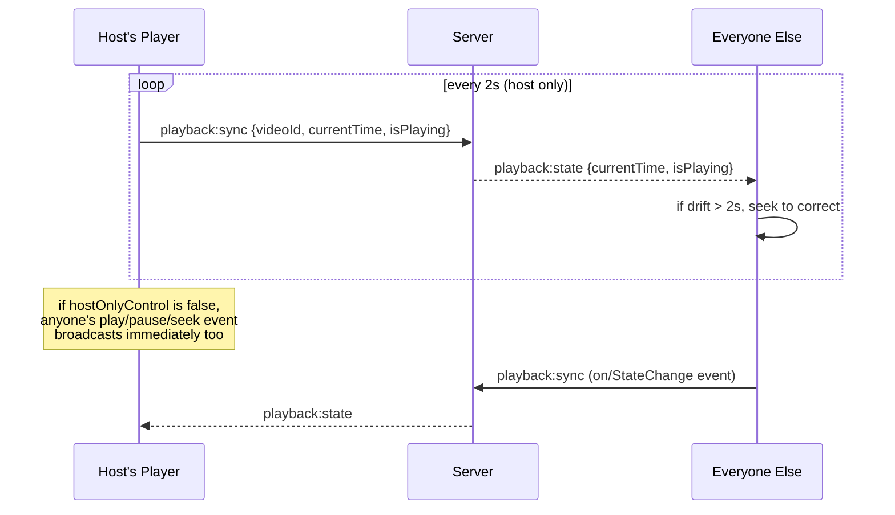

**Bug that was found and fixed:** originally *every* client ran the periodic 2-second loop, not just the host. Multiple slightly-disagreeing "authoritative" sources kept correcting each other, causing visible jitter. Fix: only the host runs the periodic tick; everyone else's actions broadcast as one-off events only.

---

## 6. Sequence: genre classification

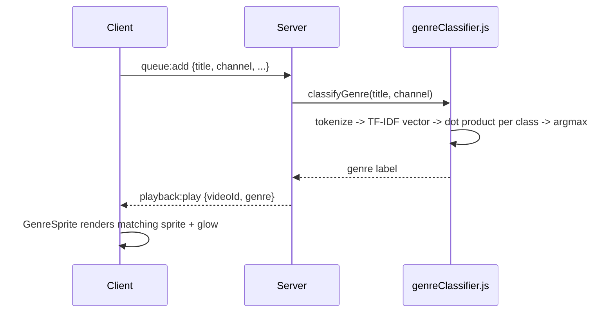

**Training pipeline (offline, not part of the request path):**

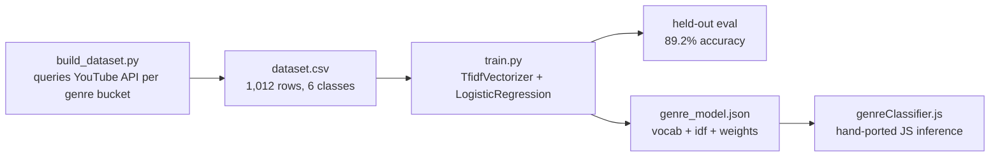

The model is trained in Python (scikit-learn) but served with zero Python at runtime — TF-IDF + a linear classifier is just a dot product, so the exported weights are reimplemented directly in JS.

---

## 7. Sequence: desktop companion connection

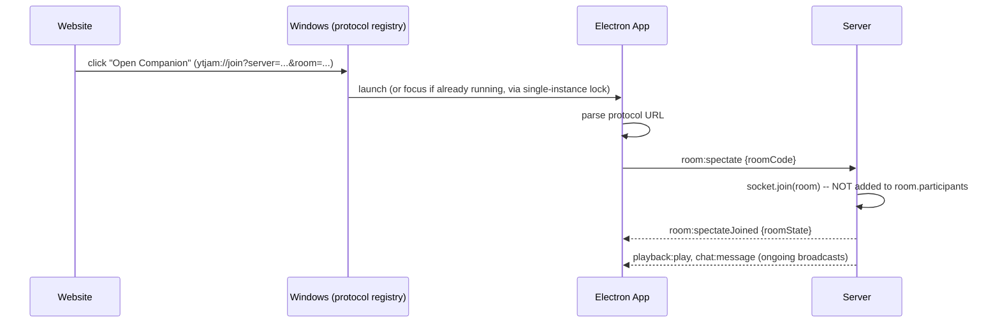

**Why "spectate" and not "join":** the companion is a visual/chat overlay, not a person — it shouldn't inflate the participant count or trigger join notifications. `room:spectate` joins the underlying Socket.IO room (so it still receives broadcasts) without touching `room.participants` at all. This is a clean split between transport-level room membership and application-level participant tracking.

---

## 8. Deployment & self-healing infrastructure

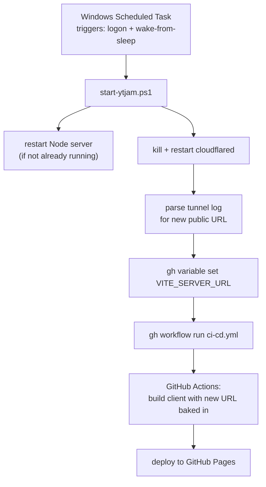

This exists because Cloudflare's free "quick tunnel" issues a *new random URL every time it restarts*. Without automation, every sleep/wake or reboot would silently break the deployed site until someone manually noticed, found the new URL, and redeployed. The scheduled task collapses that into an automatic ~30–60 second recovery.

---

## 9. Socket.IO event map (reference)

| Direction | Event | Payload |
|---|---|---|
| C→S | `room:create` | `{userName, clientId}` |
| C→S | `room:join` | `{roomCode, userName, clientId}` |
| C→S | `room:spectate` | `{roomCode}` (companion app, no participant added) |
| C→S | `queue:add` / `queue:remove` / `queue:reorder` / `queue:playNow` | track/index payloads |
| C→S | `playback:sync` | `{videoId, currentTime, isPlaying}` (gated by `hostOnlyControl`) |
| C→S | `playback:skip` | — |
| C→S | `room:setControlMode` | `{hostOnlyControl}` (host only) |
| C→S | `chat:message` | `{text}` |
| S→C | `room:created` / `room:joined` / `room:spectateJoined` | `{roomState}` |
| S→C | `room:userJoined` / `room:userLeft` | `{participants}` |
| S→C | `queue:updated` | `{queue, currentIndex}` |
| S→C | `playback:play` | `{videoId, startAt, genre}` |
| S→C | `playback:state` | `{currentTime, isPlaying, ts}` |
| S→C | `room:controlModeChanged` | `{hostOnlyControl}` |
| S→C | `chat:message` | `{id, clientId, name, text, ts}` |
| S→C | `room:error` | `{message}` |
