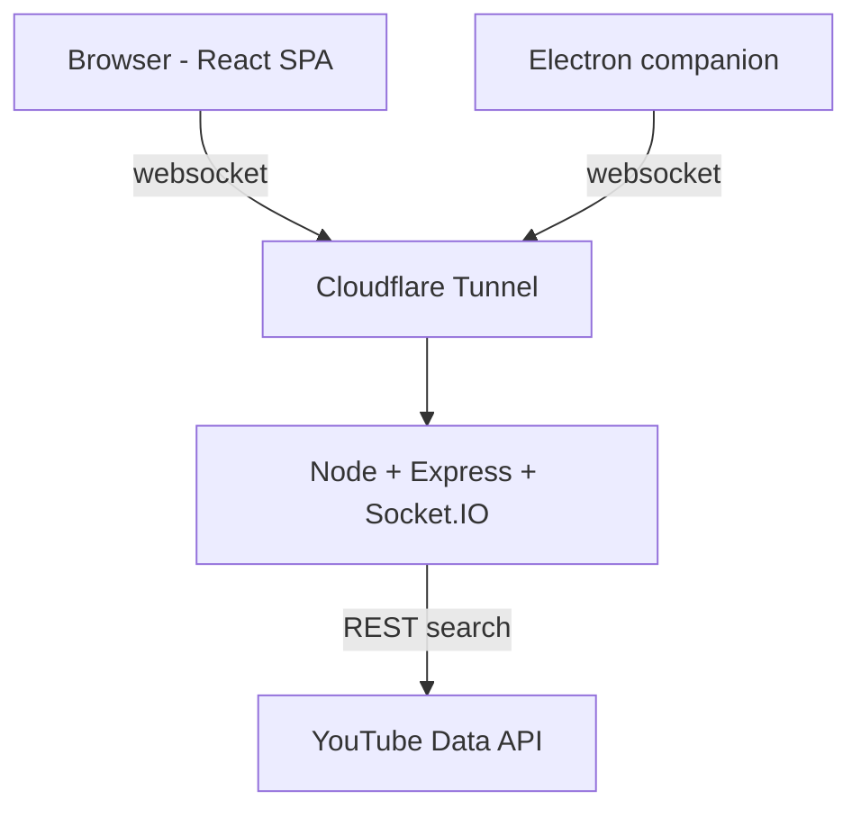
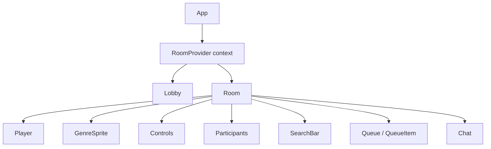
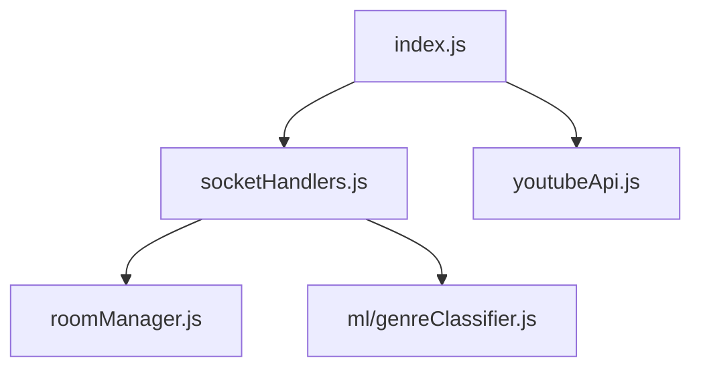
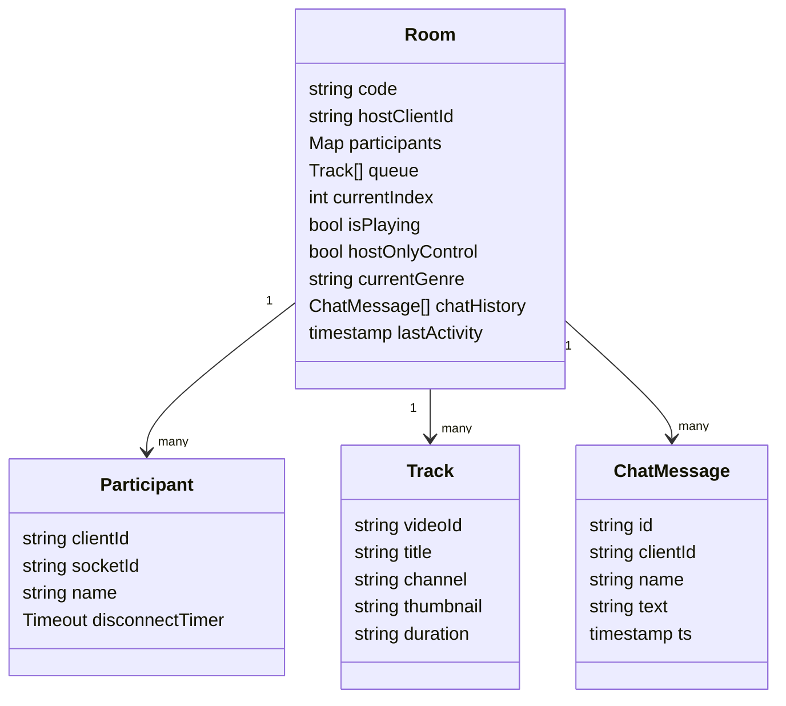
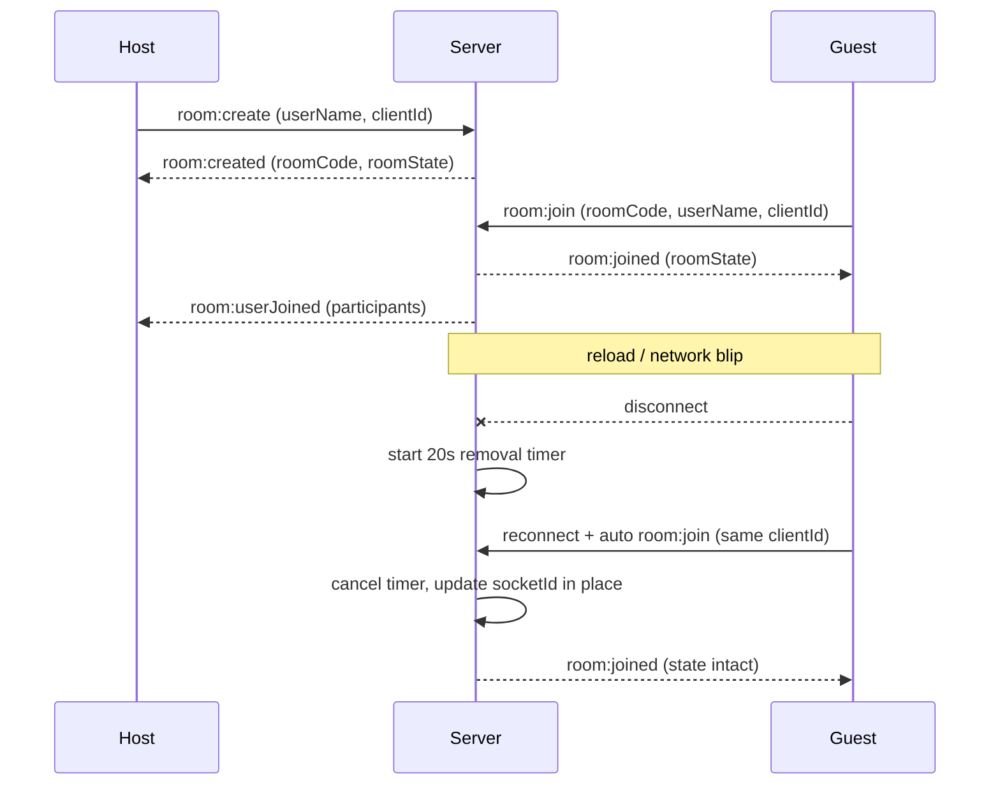
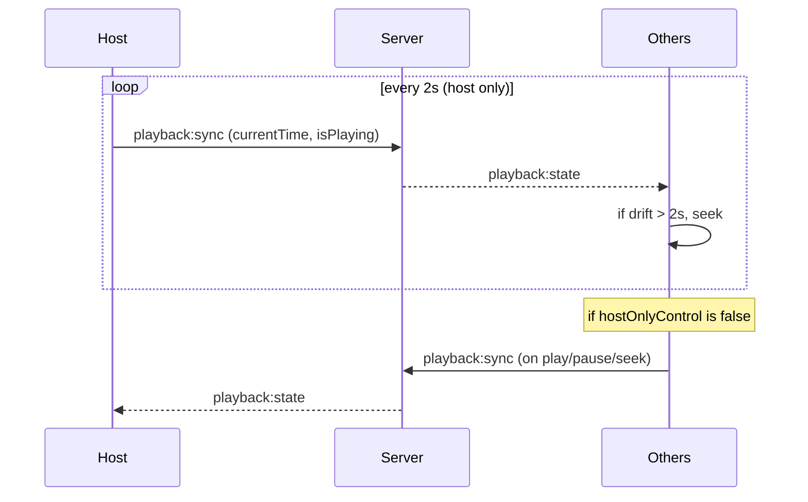
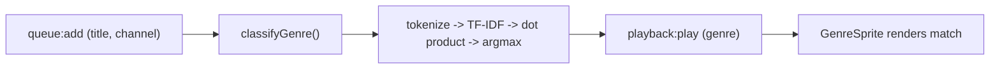
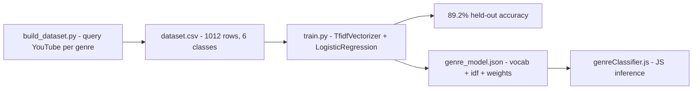
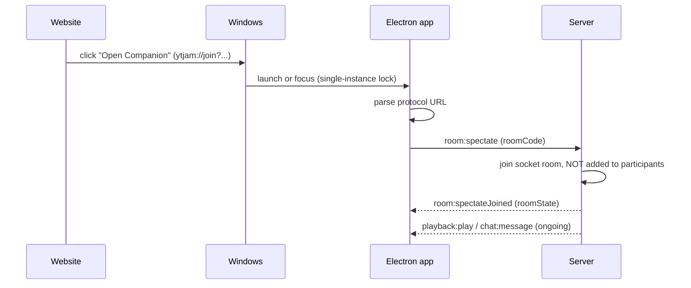
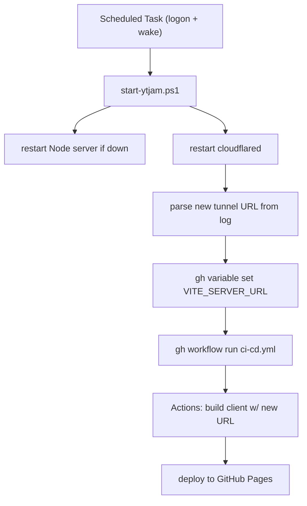

# YT Jam — System Design

> Cleaner rewrite of the architecture docs. Diagrams are kept small and
> single-purpose so they render reliably. Each Mermaid diagram is preceded by
> a plain-text version so the doc is readable even without a Mermaid renderer.

---

## Table of contents

1. [The one-paragraph summary](#1-the-one-paragraph-summary)
2. [Top-level architecture](#2-top-level-architecture)
3. [Frontend component tree](#3-frontend-component-tree)
4. [Backend modules](#4-backend-modules)
5. [Room state (data model)](#5-room-state-data-model)
6. [Flow: create / join / reconnect](#6-flow-create--join--reconnect)
7. [Flow: playback sync](#7-flow-playback-sync)
8. [Flow: genre classification](#8-flow-genre-classification)
9. [Flow: desktop companion](#9-flow-desktop-companion)
10. [Deployment & self-healing infra](#10-deployment--self-healing-infra)
11. [Socket.IO event reference](#11-socketio-event-reference)

---

## 1. The one-paragraph summary

People join a room with a 6-character code and listen to a shared YouTube
queue in sync, with live chat and a genre-reactive sprite. The frontend is a
static React app on GitHub Pages. The backend is a single Node process
(Express + Socket.IO) holding all room state in memory, running on a personal
machine and exposed to the internet through a Cloudflare Tunnel. A trained
genre classifier and a separate Electron "companion" desktop app round it out.

---

## 2. Top-level architecture

Three clients talk to one backend. The browser and the companion app both
connect over WebSocket; the backend talks to the YouTube API over plain REST.

**Plain text:**

```
  ┌─────────────────────┐         ┌──────────────────────────┐
  │  Browser (React SPA) │         │  Electron companion app  │
  │  on GitHub Pages     │         │  (transparent overlay)   │
  └──────────┬───────────┘         └────────────┬─────────────┘
             │  WebSocket                        │  WebSocket
             │  (Socket.IO)                      │  (Socket.IO)
             └───────────────┬───────────────────┘
                             ▼
                   ┌───────────────────┐
                   │  Cloudflare Tunnel │   (public HTTPS URL)
                   └─────────┬─────────┘
                             ▼
                   ┌───────────────────────────────┐
                   │  Node + Express + Socket.IO    │
                   │   • roomManager (in-memory)    │
                   │   • genreClassifier (JS)       │
                   └───────────────┬───────────────┘
                                   │  REST
                                   ▼
                       ┌────────────────────┐
                       │  YouTube Data API   │
                       └────────────────────┘

  GitHub Actions ── builds & deploys ──▶ Browser (GitHub Pages)
```

**Mermaid:**



**Why this shape:** Socket.IO needs a long-lived stateful connection, so
serverless is out. Free hosts that support persistent WebSockets now all
require a card on file (or shut down, like Glitch), so the backend self-hosts
behind a Cloudflare Tunnel. Section 10 covers the automation that handles the
downside of that choice.

---

## 3. Frontend component tree

One React context (`RoomContext`) owns all room state. `App` shows the lobby
or the room depending on whether you're in a room.

**Plain text:**

```
App
└── RoomProvider  (holds: roomCode, participants, queue, chat, genre, ...)
    ├── Lobby           (when not in a room)
    └── Room            (when in a room)
        ├── Player          YouTube IFrame + sync logic
        ├── GenreSprite     reactive sprite + glow
        ├── Controls        skip + host-control toggle
        ├── Participants    who's listening
        ├── SearchBar       search / paste URL
        ├── Queue           drag-and-drop list
        │   └── QueueItem
        └── Chat            text + emoji
```

**Mermaid:**



---

## 4. Backend modules

**Plain text:**

```
index.js          Express + Socket.IO bootstrap, /api/health, /api/search
  └── socketHandlers.js    all socket event handlers (join, queue, sync, chat)
        ├── roomManager.js       room CRUD, disconnect grace period
        └── ml/genreClassifier.js   TF-IDF + LogReg inference (pure JS)
youtubeApi.js     YouTube search + 10-min query cache
```

**Mermaid:**



---

## 5. Room state (data model)

Everything lives in a single in-memory `Map<roomCode, Room>`. No database.



**The one design choice that matters most:** `participants` is keyed by
`clientId` (a UUID saved in the browser's `localStorage`), **not** by
`socket.id`. A `socket.id` changes on every reconnect — page reload, network
blip, phone screen-lock, laptop sleep. Keying by it made participants silently
disappear and lose their playback controls on reconnect. `clientId` is stable
for the life of the browser, independent of how many times the socket drops
and reconnects underneath it.

---

## 6. Flow: create / join / reconnect



The 20-second grace window (`scheduleRemoval` in `roomManager.js`) means a
quick reconnect never even flickers the participant list. On the client,
`RoomContext` saves the session to `localStorage` and re-joins automatically
on the Socket.IO `connect` event — which fires on both first connect and every
reconnect, so reload-recovery and blip-recovery share one code path.

---

## 7. Flow: playback sync

Host is the source of truth. It broadcasts its position every 2 seconds;
others correct themselves if they've drifted more than 2 seconds.



**Bug found and fixed:** originally *every* client ran the periodic loop, so
multiple slightly-disagreeing "authorities" fought each other and the video
jittered. Fix: only the host runs the periodic tick; everyone else only emits
one-off events on actual user actions. A `suppressEcho` flag also stops a
client from re-broadcasting a seek it just applied because of someone else.

---

## 8. Flow: genre classification

**At runtime (in the request path):**



**Offline training (run once, not in the request path):**



Trained in Python, but served with **zero Python at runtime**: TF-IDF plus a
linear classifier is just arithmetic, so the exported weights are
reimplemented in ~50 lines of plain JS in the server.

---

## 9. Flow: desktop companion



**Why a separate native app at all:** a browser tab can't make a borderless,
transparent, always-on-top window — that needs the OS window manager, which
only native apps can touch (browsers block it for clickjacking-safety reasons).
Electron's `BrowserWindow` with `transparent + frameless + alwaysOnTop` does it.

**Why "spectate" and not "join":** the companion is a visual/chat overlay, not
a person, so it shouldn't count as a participant. `room:spectate` joins the
underlying Socket.IO room (to receive broadcasts) without touching
`room.participants`.

---

## 10. Deployment & self-healing infra



A Cloudflare free "quick tunnel" gets a **new random URL every restart**
(sleep/wake, reboot). Without automation, every wake would silently break the
deployed site. This script collapses "notice it's down → find new URL → update
GitHub → redeploy" into an automatic ~30–60s recovery with no manual steps.

---

## 11. Socket.IO event reference

| Dir | Event | Payload |
|-----|-------|---------|
| C→S | `room:create` | `{ userName, clientId }` |
| C→S | `room:join` | `{ roomCode, userName, clientId }` |
| C→S | `room:spectate` | `{ roomCode }` (companion; no participant added) |
| C→S | `queue:add` / `queue:remove` / `queue:reorder` / `queue:playNow` | track / index |
| C→S | `playback:sync` | `{ videoId, currentTime, isPlaying }` |
| C→S | `playback:skip` | — |
| C→S | `room:setControlMode` | `{ hostOnlyControl }` (host only) |
| C→S | `chat:message` | `{ text }` |
| S→C | `room:created` / `room:joined` / `room:spectateJoined` | `{ roomState }` |
| S→C | `room:userJoined` / `room:userLeft` | `{ participants }` |
| S→C | `queue:updated` | `{ queue, currentIndex }` |
| S→C | `playback:play` | `{ videoId, startAt, genre }` |
| S→C | `playback:state` | `{ currentTime, isPlaying, ts }` |
| S→C | `room:controlModeChanged` | `{ hostOnlyControl }` |
| S→C | `chat:message` | `{ id, clientId, name, text, ts }` |
| S→C | `room:error` | `{ message }` |
